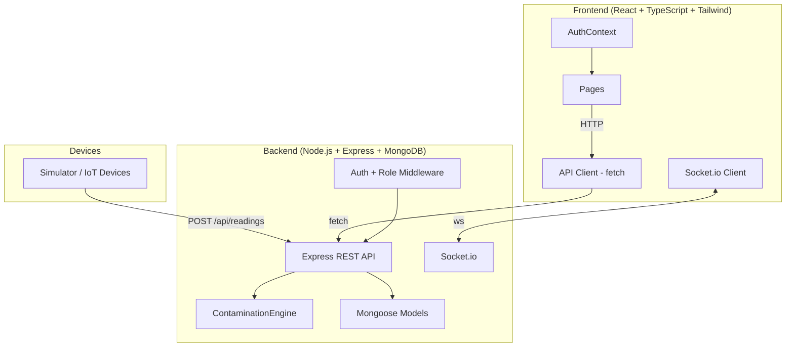

# Design Document: IsokoSense Complete Feature Implementation

## Overview

IsokoSense is a full-stack IoT water quality monitoring system built for water authorities in Rwanda (WASAC-type organisations). The backend is Node.js + Express + MongoDB/Mongoose with Socket.io for real-time events. The frontend is React 19 + TypeScript + Tailwind CSS + Recharts + Framer Motion.

This document covers all missing and incomplete features required to bring the system from its current partial implementation to a production-ready state. It is structured to build on all existing code patterns without introducing new dependencies.

---

## Architecture



### Data Flow

1. IoT devices/simulator POST sensor readings to `/api/readings`
2. `readingController.ingestReading` validates → runs `contaminationEngine.analyzeReading` → saves Reading → creates Alerts → auto-drafts critical Notifications → emits Socket.io events
3. Frontend polls REST endpoints and receives push events via Socket.io
4. Officers send Notifications (community alerts) via `/api/notifications`
5. Super Admins manage users, zones, and system configuration

---

## Data Models (Full Schemas)

### Existing Model Changes

#### User Model — `backend/models/User.js` (update)

```javascript
{
  fullName:          String, required
  email:             String, required, unique
  password:          String, required
  role:              enum ['super_admin', 'officer', 'technician', 'viewer'], default 'viewer'
  organization:      String
  isActive:          Boolean, default true
  lastLogin:         Date
  assignedLocations: [String]   // array of locationIds
  createdAt:         Date, default Date.now
}
```

`toSafeObject()` must also return `isActive`, `lastLogin`, `assignedLocations`.

#### Device Model — `backend/models/Device.js` (update)

```javascript
{
  deviceId:        String, required, unique
  locationId:      String, required
  name:            String, required
  type:            enum ['IsokoUnit', 'IsokoChamber'], required
  location:        { name, district, lat, lng }
  active:          Boolean, default true
  maintenanceMode: Boolean, default false   // NEW
  lastPing:        Date
  description:     String
}
```

### New Models

#### Zone Model — `backend/models/Zone.js`

```javascript
{
  zoneId:      String, required, unique   // e.g. 'ZONE-KACYIRU'
  name:        String, required           // e.g. 'Kacyiru Sector'
  district:    String, required
  description: String
  active:      Boolean, default true
  createdAt:   Date, default Date.now
}
```

Index: `{ zoneId: 1 }` unique, `{ active: 1 }`

#### Notification Model — `backend/models/Notification.js`

```javascript
{
  sentBy: {
    userId:   ObjectId ref 'User', required
    name:     String, required
    role:     String, required
  },
  zone: {
    zoneId:   String, required
    name:     String, required
  },
  type:           enum ['CONTAMINATION_WARNING', 'DO_NOT_USE', 'SERVICE_DISRUPTION', 'WATER_NOW_SAFE'], required
  message:        String, required
  linkedAlertId:  ObjectId ref 'Alert'   // optional
  linkedParameter: String                // e.g. 'ph', 'turbidity'
  timestamp:      Date, default Date.now, index
  status:         enum ['sent', 'draft'], default 'draft'
  expiresAt:      Date                   // timestamp + 72h, set on create
  extendedBy:     ObjectId ref 'User'    // set if super_admin extends
}
```

Indexes: `{ status: 1, timestamp: -1 }`, `{ 'zone.zoneId': 1, status: 1 }`, `{ expiresAt: 1 }` (TTL optional — we filter by expiresAt in queries)

#### MaintenanceLog Model — `backend/models/MaintenanceLog.js`

```javascript
{
  deviceId:         String, required, index
  loggedBy: {
    userId:   ObjectId ref 'User', required
    name:     String, required
    role:     String, required
  },
  activity:         String, required      // e.g. 'Sensor calibration'
  notes:            String
  date:             Date, default Date.now, index
  maintenanceMode:  Boolean, default false  // was device in maintenance when logged
}
```

Index: `{ deviceId: 1, date: -1 }`

---

## Components and Interfaces

### Backend Components

**roleMiddleware** (`backend/middleware/roleMiddleware.js`)
- `requireRole(...roles)` — Express middleware factory; returns 403 when `req.user.role` is not in the allowed list.

**authController** (`backend/controllers/authController.js`)
- `register(req, res)` — creates user; requires super_admin JWT or bootstrap mode.
- `login(req, res)` — issues JWT; checks `isActive`; updates `lastLogin`.
- `me(req, res)` — returns current user safe object.

**notificationController** (`backend/controllers/notificationController.js`)
- `createNotification(req, res)` — creates Notification with `expiresAt = now + 72h`.
- `getAllNotifications(req, res)` — paginated list with filters.
- `getZoneNotifications(req, res)` — public; sent + non-expired only.
- `getNotificationById(req, res)` — single document lookup.
- `extendNotification(req, res)` — adds 72h to `expiresAt`.
- `deleteNotification(req, res)` — permanent delete.

**zoneController** (`backend/controllers/zoneController.js`)
- `getAllZones(req, res)`, `createZone(req, res)`, `updateZone(req, res)`, `deactivateZone(req, res)`

**userController** (`backend/controllers/userController.js`)
- `getAllUsers(req, res)` — paginated users list.
- `updateUser(req, res)` — role/status update with self-modification guard.
- `deactivateUser(req, res)` — soft delete.

**maintenanceController** (`backend/controllers/maintenanceController.js`)
- `logMaintenance(req, res)`, `getMaintenanceHistory(req, res)`, `toggleMaintenanceMode(req, res)`

### Frontend Components

**AuthContext** (`frontend/src/context/AuthContext.tsx`)
- Provides: `user`, `loading`, `login`, `register`, `logout`, `isSuperAdmin`, `isOfficer`, `isTechnician`, `isViewer`, `canNotify`, `canResolveAlerts`, `canManageDevices`.

**RoleGuard** (`frontend/src/components/RoleGuard.tsx`)
- Props: `roles: string[]`, `children: React.ReactNode`. Redirects to `/` if role not allowed.

**NotificationDispatchModal** (`frontend/src/components/NotificationDispatchModal.tsx`)
- Props: `onClose: () => void`, `linkedAlert?: Alert`, `defaultZoneId?: string`.
- Interface: zone selector, type selector, message textarea, preview card, Send/Draft buttons.

**MaintenanceModal** (`frontend/src/components/MaintenanceModal.tsx`)
- Props: `device: Device`, `onClose: () => void`.
- Interface: tabbed — "Log Activity" (form) and "History" (list).

---

## Data Models

See the full schema definitions in the **Data Models (Full Schemas)** section above. Summary:

| Model | File | Status |
|-------|------|--------|
| User | `backend/models/User.js` | Update — add `isActive`, `lastLogin`, `assignedLocations`; expand `role` enum |
| Device | `backend/models/Device.js` | Update — add `maintenanceMode` |
| Zone | `backend/models/Zone.js` | New |
| Notification | `backend/models/Notification.js` | New |
| MaintenanceLog | `backend/models/MaintenanceLog.js` | New |
| Alert | `backend/models/Alert.js` | No change |
| Reading | `backend/models/Reading.js` | No change |

---

## Error Handling

| Scenario | HTTP Status | Response Body |
|----------|-------------|---------------|
| Missing JWT | 401 | `{ message: 'No token provided' }` |
| Invalid/expired JWT | 401 | `{ message: 'Invalid or expired token' }` |
| Role not authorized | 403 | `{ message: 'Access denied' }` |
| Deactivated user login | 403 | `{ message: 'Account deactivated' }` |
| Resource not found | 404 | `{ message: '<Resource> not found' }` |
| Duplicate resource | 409 | `{ message: '<Resource> already registered/exists' }` |
| Validation failure | 400 | `{ message: 'Validation failed', errors: [...] }` |
| Self-modification attempt | 400 | `{ message: 'Cannot modify your own account role or status' }` |
| Server error | 500 | `{ message: err.message \|\| 'Internal server error' }` |

Frontend error handling follows the existing `ApiError` class pattern in `client.js` — all non-OK responses throw `ApiError` with the server's message and HTTP status.

---

## Testing Strategy

### Unit Testing Approach

Unit tests verify specific controller functions and service logic in isolation. Use Node.js `assert` or Jest.

Key unit test targets:
- `authController.login` — deactivated user returns 403, successful login updates `lastLogin`
- `notificationController.createNotification` — `expiresAt` equals `timestamp + 72h`
- `roleMiddleware.requireRole` — returns 403 for non-matching roles, calls `next()` for matching roles
- `userController.updateUser` — returns 400 on self-modification

### Property-Based Testing Approach

**Property Test Library**: fast-check (JavaScript)

Properties defined in the Correctness Properties section should each be implemented as a property-based test using `fc.asyncProperty` from fast-check. Each generates random inputs (user roles, reading values, notification payloads) and asserts the universal property holds.

### Integration Testing Approach

Integration tests use a test MongoDB instance (in-memory with `mongodb-memory-server` or a local test DB). Each test:
1. Seeds the minimum required data
2. Makes HTTP requests to the Express app
3. Asserts response shape and side effects (DB state)

End-to-end: seed script → start server → run simulator for 60s → verify dashboard counts match expected ranges.

---

## RBAC Matrix

| Action | super_admin | officer | technician | viewer |
|--------|-------------|---------|------------|--------|
| Register / manage users | ✅ | ❌ | ❌ | ❌ |
| View all data | ✅ | ✅ | ✅ | ✅ |
| Resolve alerts | ✅ | ✅ | ❌ | ❌ |
| Send notifications | ✅ | ✅ | ❌ | ❌ |
| Extend notification expiry | ✅ | ❌ | ❌ | ❌ |
| Delete notifications | ✅ | ❌ | ❌ | ❌ |
| Register/update devices | ✅ | ❌ | ✅ | ❌ |
| Deactivate devices | ✅ | ❌ | ❌ | ❌ |
| Toggle maintenance mode | ✅ | ❌ | ✅ | ❌ |
| Log maintenance activity | ✅ | ❌ | ✅ | ❌ |
| Manage zones | ✅ | ❌ | ❌ | ❌ |
| Ingest readings (IoT) | public | public | public | public |
| View notifications (public feed) | ✅ | ✅ | ✅ | ✅ |

---

## API Contracts

### Auth Routes — `backend/routes/authRoutes.js` (update)

| Method | Path | Auth | Role | Description |
|--------|------|------|------|-------------|
| POST | /api/auth/register | authMiddleware | super_admin | Create user (restricted) |
| POST | /api/auth/login | — | — | Login, records lastLogin |
| GET | /api/auth/me | authMiddleware | any | Current user |

**POST /api/auth/register** — now requires `authMiddleware` + `requireRole('super_admin')`.  
Exception: if zero users exist in the DB, allow unauthenticated bootstrap (first user becomes super_admin).

**POST /api/auth/login** response adds: `user.isActive`, `user.lastLogin`, `user.assignedLocations`.  
If `user.isActive === false` → respond 403 `{ message: 'Account deactivated' }`.

### User Management Routes — `backend/routes/userRoutes.js` (new)

| Method | Path | Auth | Role | Description |
|--------|------|------|------|-------------|
| GET | /api/users | authMiddleware | super_admin | List all users (paginated) |
| PATCH | /api/users/:id | authMiddleware | super_admin | Update role / isActive |
| DELETE | /api/users/:id | authMiddleware | super_admin | Deactivate (set isActive=false) |

**GET /api/users** query params: `?page=1&limit=20`  
Response: `{ users: [...safeObjects], pagination: { page, limit, total, pages } }`

**PATCH /api/users/:id** body: `{ role?, isActive?, organization?, assignedLocations? }`  
Returns updated user safe object. Cannot change own role.

**DELETE /api/users/:id** — soft-deletes by setting `isActive: false`. Cannot delete self.

### Alert Routes — `backend/routes/alertRoutes.js` (update)

`PATCH /:id/resolve` — change role check from `admin` to `requireRole('super_admin','officer')`.

### Device Routes — `backend/routes/deviceRoutes.js` (update)

| Method | Path | Auth | Role | Description |
|--------|------|------|------|-------------|
| GET | /api/devices | authMiddleware | any | List devices |
| POST | /api/devices | authMiddleware | super_admin, technician | Register device |
| GET | /api/devices/:id/status | authMiddleware | any | Device status |
| PATCH | /api/devices/:id | authMiddleware | super_admin, technician | Update device |
| POST | /api/devices/:id/maintenance | authMiddleware | super_admin, technician | Log maintenance activity |
| GET | /api/devices/:id/maintenance | authMiddleware | super_admin, officer, technician | Get maintenance history |
| PATCH | /api/devices/:id/maintenance-mode | authMiddleware | super_admin, technician | Toggle maintenance mode |

**POST /api/devices/:id/maintenance** body: `{ activity, notes?, maintenanceMode? }`  
Creates a `MaintenanceLog` doc. `loggedBy` populated from `req.user`. Returns the new log entry.

**GET /api/devices/:id/maintenance** response: `{ logs: [...] }`

**PATCH /api/devices/:id/maintenance-mode** body: `{ maintenanceMode: boolean }`  
Updates `Device.maintenanceMode`. Returns updated device. Emits `device:maintenanceMode` Socket.io event.

### Notification Routes — `backend/routes/notificationRoutes.js` (new)

| Method | Path | Auth | Role | Description |
|--------|------|------|------|-------------|
| POST | /api/notifications | authMiddleware | super_admin, officer | Send or save draft notification |
| GET | /api/notifications | authMiddleware | any | List all (paginated, filterable) |
| GET | /api/notifications/zone/:zoneId | — | public | Public zone feed |
| GET | /api/notifications/:id | authMiddleware | any | Single notification |
| PATCH | /api/notifications/:id/extend | authMiddleware | super_admin | Extend expiry by 72h |
| DELETE | /api/notifications/:id | authMiddleware | super_admin | Delete notification |

**POST /api/notifications** body:
```json
{
  "zoneId": "ZONE-KACYIRU",
  "type": "CONTAMINATION_WARNING",
  "message": "High turbidity detected...",
  "linkedAlertId": "...",
  "linkedParameter": "turbidity",
  "status": "sent"
}
```
Sets `expiresAt = timestamp + 72h`. `sentBy` populated from `req.user`.  
Emits `notification:new` Socket.io event when `status === 'sent'`.

**GET /api/notifications** query: `?page=1&limit=20&status=sent&zoneId=ZONE-KACYIRU&includeExpired=false`  
Default: excludes expired (expiresAt < now) unless `includeExpired=true`.

**GET /api/notifications/zone/:zoneId** — public endpoint, returns only `status:'sent'` non-expired notifications for that zone.

**PATCH /api/notifications/:id/extend** — adds 72h to current `expiresAt`, sets `extendedBy`.

### Zone Routes — `backend/routes/zoneRoutes.js` (new)

| Method | Path | Auth | Role | Description |
|--------|------|------|------|-------------|
| GET | /api/zones | authMiddleware | any | List all active zones |
| POST | /api/zones | authMiddleware | super_admin | Create zone |
| PATCH | /api/zones/:id | authMiddleware | super_admin | Update zone |
| DELETE | /api/zones/:id | authMiddleware | super_admin | Deactivate zone (soft) |

### Dashboard Route — `backend/routes/dashboardRoutes.js` (update)

**GET /api/dashboard/summary** — add to response:
```json
{
  "notificationsSent24h": 3,
  "pendingDraftNotifications": [...],
  "maintenanceDevices": {
    "count": 1,
    "devices": [{ "deviceId": "ISC-001", "name": "..." }]
  }
}
```

---

## Backend Implementation Details

### roleMiddleware — `backend/middleware/roleMiddleware.js` (update)

```javascript
// Fix typo "Acess" → "Access", export as requireRole
module.exports = (...roles) => (req, res, next) => {
  if (!roles.includes(req.user.role)) {
    return res.status(403).json({ message: 'Access denied' });
  }
  next();
};
```

### authController — `backend/controllers/authController.js` (update)

`register`:
- Wrap with `authMiddleware` + `requireRole('super_admin')` in the route (not in the controller).
- Bootstrap exception: `if (await User.countDocuments() === 0)` allow unauthenticated, force role to `super_admin`.
- Accepted roles: `['super_admin','officer','technician','viewer']`.

`login`:
- Check `user.isActive !== false` before issuing token.
- Set `user.lastLogin = new Date()` and save.
- Return expanded user safe object.

### readingController — `backend/controllers/readingController.js` (update)

In `ingestReading`, after creating alerts, for any alert with `severity === 'critical'`:
```javascript
// Auto-create draft notification
const zone = await Zone.findOne({ active: true }); // find zone matching locationId if possible
if (zone) {
  await Notification.create({
    sentBy: { userId: null, name: 'System', role: 'system' },
    zone: { zoneId: zone.zoneId, name: zone.name },
    type: 'CONTAMINATION_WARNING',
    message: alert.remediation,
    linkedAlertId: alert._id,
    linkedParameter: alert.parameter,
    status: 'draft',
    expiresAt: new Date(Date.now() + 72 * 60 * 60 * 1000),
    timestamp: new Date(),
  });
}
```
Emit `notification:draft` Socket.io event.

### server.js (update)

Mount new routes:
```javascript
const notificationRoutes = require('./routes/notificationRoutes');
const zoneRoutes = require('./routes/zoneRoutes');
const userRoutes = require('./routes/userRoutes');

app.use('/api/notifications', notificationRoutes);
app.use('/api/zones', zoneRoutes);
app.use('/api/users', userRoutes);
```

---

## Frontend Architecture

### Component Tree

```
App.tsx
└── AuthProvider (AuthContext.tsx)
    └── BrowserRouter
        ├── /login          → LoginPage
        └── ProtectedLayout (Layout.tsx)
            ├── Sidebar.tsx   (4-role nav)
            ├── Header.tsx
            └── <Outlet>
                ├── /              → OverviewPage (enhanced)
                ├── /live          → LiveMonitoringPage (enhanced)
                ├── /history       → HistoricalDataPage (unchanged)
                ├── /alerts        → AlertsPage (enhanced)
                ├── /notifications → NotificationsPage (new)
                ├── /devices       → DevicesPage (enhanced)
                ├── /users         → UsersPage (new, super_admin only)
                └── /admin         → AdminPanel (new, super_admin only)
```

### AuthContext — `frontend/src/context/AuthContext.tsx` (update)

Expand with role helpers:
```typescript
interface AuthContextValue {
  user: User | null;
  loading: boolean;
  login: (email: string, password: string) => Promise<any>;
  register: (payload: RegisterPayload) => Promise<any>;
  logout: () => void;
  // Role helpers
  isSuperAdmin: boolean;
  isOfficer: boolean;
  isTechnician: boolean;
  isViewer: boolean;
  canNotify: boolean;       // super_admin || officer
  canResolveAlerts: boolean; // super_admin || officer
  canManageDevices: boolean; // super_admin || technician
}
```

Remove legacy `isAdmin` — replace all usages across pages with the new helpers.

### User Type — `frontend/src/types/index.ts` (new)

```typescript
export interface User {
  id: string;
  fullName: string;
  email: string;
  role: 'super_admin' | 'officer' | 'technician' | 'viewer';
  organization?: string;
  isActive: boolean;
  lastLogin?: string;
  assignedLocations?: string[];
}

export interface Alert {
  _id: string;
  deviceId: string;
  locationId: string;
  locationName?: string;
  parameter: 'ph' | 'turbidity' | 'temperature' | 'tds';
  measuredValue: number;
  safeRange: string;
  severity: 'warning' | 'critical';
  remediation: string;
  reading: { ph: number; turbidity: number; temperature: number; tds: number; timestamp: string };
  resolved: boolean;
  resolvedAt?: string;
  timestamp: string;
}

export interface Notification {
  _id: string;
  sentBy: { userId: string | null; name: string; role: string };
  zone: { zoneId: string; name: string };
  type: 'CONTAMINATION_WARNING' | 'DO_NOT_USE' | 'SERVICE_DISRUPTION' | 'WATER_NOW_SAFE';
  message: string;
  linkedAlertId?: string;
  linkedParameter?: string;
  timestamp: string;
  status: 'sent' | 'draft';
  expiresAt: string;
}

export interface Zone {
  _id: string;
  zoneId: string;
  name: string;
  district: string;
  description?: string;
  active: boolean;
}

export interface MaintenanceLog {
  _id: string;
  deviceId: string;
  loggedBy: { userId: string; name: string; role: string };
  activity: string;
  notes?: string;
  date: string;
  maintenanceMode: boolean;
}
```

### Sidebar — `frontend/src/components/Sidebar.tsx` (update)

Replace `adminLinks` / `viewerLinks` with role-based link sets:

```typescript
// super_admin: Overview, Live, History, Alerts, Notifications, Devices, Users, Admin
// officer:     Overview, Live, History, Alerts, Notifications
// technician:  Overview, Live, History, Alerts (view), Devices
// viewer:      Overview, Live, History, Alerts (view), Notifications (read)
```

Use `isSuperAdmin`, `isOfficer`, `isTechnician`, `isViewer` from `useAuth()`.

### App.tsx (update)

Add new routes:
```typescript
<Route path="/notifications" element={<NotificationsPage />} />
<Route path="/users" element={<RoleGuard roles={['super_admin']}><UsersPage /></RoleGuard>} />
<Route path="/admin" element={<RoleGuard roles={['super_admin']}><AdminPanel /></RoleGuard>} />
```

`RoleGuard` is a small inline wrapper that checks `user.role` and redirects to `/` if not authorized.

### API Client — `frontend/src/api/client.js` (update)

Add new methods:
```javascript
// Notifications
getNotifications: (params = {}) => request(`/api/notifications?${new URLSearchParams(params)}`),
getZoneNotifications: (zoneId) => request(`/api/notifications/zone/${zoneId}`),
getNotification: (id) => request(`/api/notifications/${id}`),
sendNotification: (payload) => request('/api/notifications', { method: 'POST', body: JSON.stringify(payload) }),
extendNotification: (id) => request(`/api/notifications/${id}/extend`, { method: 'PATCH' }),
deleteNotification: (id) => request(`/api/notifications/${id}`, { method: 'DELETE' }),

// Zones
getZones: () => request('/api/zones'),
createZone: (payload) => request('/api/zones', { method: 'POST', body: JSON.stringify(payload) }),
updateZone: (id, payload) => request(`/api/zones/${id}`, { method: 'PATCH', body: JSON.stringify(payload) }),

// Users
getUsers: (params = {}) => request(`/api/users?${new URLSearchParams(params)}`),
updateUser: (id, payload) => request(`/api/users/${id}`, { method: 'PATCH', body: JSON.stringify(payload) }),
deactivateUser: (id) => request(`/api/users/${id}`, { method: 'DELETE' }),

// Device maintenance
logMaintenance: (deviceId, payload) => request(`/api/devices/${deviceId}/maintenance`, { method: 'POST', body: JSON.stringify(payload) }),
getMaintenanceLogs: (deviceId) => request(`/api/devices/${deviceId}/maintenance`),
toggleMaintenanceMode: (deviceId, mode) => request(`/api/devices/${deviceId}/maintenance-mode`, { method: 'PATCH', body: JSON.stringify({ maintenanceMode: mode }) }),
```

---

## Frontend Pages — New

### NotificationsPage — `frontend/src/pages/NotificationsPage.tsx`

Two-panel layout based on role:

**Public Feed (all roles):**
- Fetch GET `/api/notifications?status=sent&includeExpired=false`
- Grouped by zone
- Each notification card shows:
  - Zone name + type badge (color-coded: red=CONTAMINATION_WARNING, black=DO_NOT_USE, orange=SERVICE_DISRUPTION, green=WATER_NOW_SAFE)
  - Message text
  - "Sent X hours ago" (computed from `timestamp`)
  - "Sent by [sentBy.name]" (show organization from sentBy.role)
  - Auto-hides when `expiresAt < now` (client-side filter in addition to server filter)

**Officer/SuperAdmin extras:**
- "Send Notification" button → opens `NotificationDispatchModal`
- Tab to view draft notifications (pending system-generated drafts)
- "Review & Send" button on draft cards → pre-fills dispatch modal
- "Delete" button on sent notifications (super_admin only)

**NotificationDispatchModal — `frontend/src/components/NotificationDispatchModal.tsx`:**
- Zone selector (dropdown from GET /api/zones)
- Type selector (4 types with color-coded badges)
- Message textarea (auto-populated if launched from alert with alert.remediation)
- Affected parameter display (auto-populated if from alert)
- Preview section showing how notification will appear
- "Send Now" → POST /api/notifications with status='sent'
- "Save Draft" (super_admin only) → POST with status='draft'

### UsersPage — `frontend/src/pages/UsersPage.tsx` (super_admin only)

- Table columns: fullName, email, role badge, status (Active/Inactive), lastLogin, organization
- Role badge colors: super_admin=purple, officer=blue, technician=orange, viewer=gray
- "Add User" button → `CreateUserModal`
- Inline role/status edit via dropdown
- "Deactivate" button (soft delete)
- "Reactivate" button for inactive users

**CreateUserModal:**
- Fields: fullName, email, password, role (select), organization
- Calls POST /api/auth/register (with super_admin token)
- On success: refreshes user list

### AdminPanel — `frontend/src/pages/AdminPanel.tsx` (super_admin only)

Four sections in tabs or cards:

1. **System Health** — static cards showing: API status (via GET /api/health), device connectivity summary from dashboard
2. **Community Zones** — CRUD table for zones (GET/POST/PATCH /api/zones)
3. **Notification Statistics** — count by type (last 7 days), bar chart using Recharts BarChart
4. **Audit Note** — read-only panel explaining that full audit log is a future feature

---

## Frontend Pages — Enhanced

### OverviewPage — `frontend/src/pages/OverviewPage.tsx` (update)

Add after the stat cards section (conditional on `canNotify`):
```
"Pending Community Notifications" panel
  - Fetches GET /api/notifications?status=draft from dashboard summary pendingDraftNotifications
  - Shows up to 3 draft cards with "Review & Send" button each
  - "Review & Send" opens NotificationDispatchModal pre-filled
```

Add "Notify Community" button next to each critical alert in the recentAlerts feed (conditional on `canNotify`).

### AlertsPage — `frontend/src/pages/AlertsPage.tsx` (update)

In expanded alert detail panel:
- "Notify Community" button (conditional on `canNotify`) → opens `NotificationDispatchModal` pre-filled with `alert.remediation` and `alert.parameter`
- "Resolve Alert" button conditional on `canResolveAlerts` (was `isAdmin` → now `canResolveAlerts`)

### LiveMonitoringPage — `frontend/src/pages/LiveMonitoringPage.tsx` (update)

After the parameter cards grid, when any parameter is in warning or critical status, show a dismissible banner:
```
⚠️ Parameter [name] is in [Warning/Critical] range.
[Notify Community] button (conditional on canNotify)
```
"Notify Community" opens `NotificationDispatchModal` with type pre-set based on severity (WARNING→CONTAMINATION_WARNING, CRITICAL→DO_NOT_USE).

### DevicesPage — `frontend/src/pages/DevicesPage.tsx` (update)

Role-based access:
- `super_admin`: full access — add device, deactivate, edit, toggle maintenance, view all logs
- `technician`: update device info, toggle maintenance mode, log maintenance, view maintenance history
- `viewer`/`officer`: read-only table (remove the "Device management is restricted to administrators" block, show read-only view)

Add to device table row:
- "Maintenance" badge (orange, shown when `device.maintenanceMode === true`)
- "Maintenance" button (opens `MaintenanceModal`, visible to super_admin + technician)

**MaintenanceModal — `frontend/src/components/MaintenanceModal.tsx`:**
- Two tabs: "Log Activity" and "History"
- Log Activity: activity text field, notes textarea, "Toggle Maintenance Mode" toggle, "Submit" button
- History: list of MaintenanceLog entries (GET /api/devices/:id/maintenance)

---

## File Structure (New Files)

```
backend/
  models/
    Zone.js                        (new)
    Notification.js                (new)
    MaintenanceLog.js              (new)
  controllers/
    notificationController.js      (new)
    zoneController.js              (new)
    userController.js              (new)
    maintenanceController.js       (new)
  routes/
    notificationRoutes.js          (new)
    zoneRoutes.js                  (new)
    userRoutes.js                  (new)
  scripts/
    seed.js                        (update — 4 users, 3 zones, 5 notifications, 3 maintenance logs)

frontend/src/
  types/
    index.ts                       (new)
  pages/
    NotificationsPage.tsx          (new)
    UsersPage.tsx                  (new)
    AdminPanel.tsx                 (new)
    OverviewPage.tsx               (update)
    AlertsPage.tsx                 (update)
    LiveMonitoringPage.tsx         (update)
    DevicesPage.tsx                (update)
  components/
    NotificationDispatchModal.tsx  (new)
    MaintenanceModal.tsx           (new)
    RoleGuard.tsx                  (new)

README.md                          (new, project root)
```

---

## State Management Approach

State is managed entirely with React's built-in `useState` + `useEffect` hooks, consistent with the existing codebase. No additional state management library is introduced.

- **AuthContext**: global user/auth state, role helpers
- **Page-level state**: each page manages its own fetch/filter/form state via `useState`
- **Socket.io**: frontend connects to the backend Socket.io server on mount in pages that require real-time updates (LiveMonitoringPage, NotificationsPage, AlertsPage). Events: `reading:new`, `alert:new`, `alert:resolved`, `notification:new`, `notification:draft`, `device:maintenanceMode`

---

## Correctness Properties

*A property is a characteristic or behavior that should hold true across all valid executions of a system — essentially, a formal statement about what the system should do.*

### Property 1: Role authorization is enforced on all protected routes

*For any* authenticated request where the user's role is not in the allowed roles list for an endpoint, the API SHALL return HTTP 403 with `{ message: 'Access denied' }`.

**Validates: Requirements 1.1, 1.2, 1.3**

### Property 2: Notification expiry is always 72 hours from creation

*For any* notification created via POST /api/notifications, `expiresAt` SHALL equal `timestamp + 72 hours` (±1 second tolerance for processing time).

**Validates: Requirements 2.3**

### Property 3: Draft auto-creation on critical alerts

*For any* reading that produces a critical-severity alert and whose locationId maps to an existing active Zone, a Notification with `status='draft'` SHALL be created, linked to that alert via `linkedAlertId`.

**Validates: Requirements 2.6**

### Property 4: User deactivation blocks login

*For any* user where `isActive === false`, the login endpoint SHALL return HTTP 403 (not 200 with token) regardless of whether the password is correct.

**Validates: Requirements 1.5**

### Property 5: Maintenance mode reflects in device status

*For any* device where `maintenanceMode === true`, the device listing response SHALL include `maintenanceMode: true`, and the dashboard `maintenanceDevices.count` SHALL include that device.

**Validates: Requirements 3.3, 5.3**

### Property 6: Notification public feed excludes expired and draft entries

*For any* GET /api/notifications/zone/:zoneId response, all returned notifications SHALL have `status === 'sent'` AND `expiresAt > Date.now()`.

**Validates: Requirements 2.4**

### Property 7: Role update does not allow self-modification

*For any* PATCH /api/users/:id request where `:id` resolves to the authenticated user's own ID, the API SHALL return HTTP 400 and SHALL NOT update the user's role.

**Validates: Requirements 4.3**
