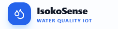

# 💧 IsokoSense

<p align="center">
  
</p>

<p align="center">
  <b>IoT-Based Intelligent Water Quality Monitoring System</b><br>
  Real-time monitoring of water quality in pipelines and community water points using IoT, cloud technologies, and live dashboards.
</p>

<p align="center">
  
  
  
  
  
</p>

---

# 📖 Overview

**IsokoSense** is an IoT-powered water quality monitoring system designed to improve the safety and reliability of water distribution networks.

The platform continuously collects sensor readings from:

* **Isoko Units** – Community water access monitoring devices.
* **IsokoChambers** – Underground pipeline monitoring devices.

The collected data is transmitted to a cloud backend where it is analyzed against WHO water quality thresholds and displayed through a real-time monitoring dashboard.

---

# ✨ Features

* 📡 Real-time sensor monitoring
* 🌊 Water quality assessment
* 🚨 Automatic contamination alerts
* 📈 Historical data visualization
* 🔌 WebSocket-powered live updates
* 👥 Role-based authentication
* 📊 Dashboard analytics
* 📥 CSV export
* 🖥 Device management

---

# 🏗 System Architecture

```text
ESP32 Sensors
       │
       ▼
+----------------+
|   REST API     |
|  Node.js API   |
+----------------+
       │
       ▼
+----------------+
|    MongoDB     |
|   Database     |
+----------------+
       │
       ▼
+----------------+
|   Socket.IO    |
| Realtime Layer |
+----------------+
       │
       ▼
+----------------+
| React Dashboard|
+----------------+
```

---

# 🛠 Technology Stack

| Layer          | Technology                             |
| -------------- | -------------------------------------- |
| Frontend       | React + Vite + Tailwind CSS + Recharts |
| Backend        | Node.js + Express                      |
| Database       | MongoDB                                |
| Real-time      | Socket.IO                              |
| Authentication | JWT                                    |
| Deployment     | Docker / Nginx (Optional)              |

---

# 📂 Project Structure

```text
IsokoSense/
├── backend/
│   ├── config/
│   ├── controllers/
│   ├── middleware/
│   ├── models/
│   ├── routes/
│   ├── scripts/
│   ├── services/
│   ├── simulator.js
│   └── server.js
│
├── frontend/
│   └── src/
│       ├── api/
│       ├── components/
│       ├── context/
│       └── pages/
│
└── README.md
```

---

# 🚀 Getting Started

## Prerequisites

* Node.js 18+
* MongoDB Community Server or MongoDB Atlas
* Git

---

# Backend Setup

```bash
cd backend
npm install
cp .env.example .env
npm run seed
npm run dev
```

Server runs on:

```text
http://localhost:5000
```

---

# Frontend Setup

```bash
cd frontend
npm install
cp .env.example .env
npm run dev
```

Dashboard:

```text
http://localhost:5173
```

---

# Sensor Simulator

To simulate ESP32 readings:

```bash
cd backend
npm run simulate
```

The simulator:

* Generates readings every 15 seconds.
* Injects abnormal values randomly.
* Automatically triggers alerts.

---

# 🔑 Demo Accounts

| Role   | Email                                                 | Password  |
| ------ | ----------------------------------------------------- | --------- |
| Admin  | [admin@isokosense.com](mailto:admin@isokosense.com)   | admin123  |
| Viewer | [viewer@isokosense.com](mailto:viewer@isokosense.com) | viewer123 |

---

# ⚙ Environment Variables

## Backend `.env`

```env
MONGODB_URI=mongodb://localhost:27017/isokosense
PORT=5000
JWT_SECRET=your_secret
CORS_ORIGIN=http://localhost:5173
OFFLINE_THRESHOLD_MINUTES=5
API_URL=http://localhost:5000
```

---

## Frontend `.env`

```env
VITE_API_URL=http://localhost:5000
```

---

# 📡 API Documentation

## Health

```http
GET /api/health
```

---

## Authentication

```http
POST /api/auth/register
POST /api/auth/login
GET /api/auth/me
```

---

## Sensor Ingestion

```http
POST /api/readings
```

Body:

```json
{
  "deviceId": "ISK-001",
  "locationId": "KGL-001",
  "ph": 7.2,
  "turbidity": 2,
  "temperature": 24,
  "tds": 180,
  "timestamp": "2026-06-27T10:00:00Z"
}
```

---

## Readings

```http
GET /api/readings
GET /api/readings/latest
GET /api/readings/:deviceId
GET /api/readings/:deviceId/history
```

---

## Alerts

```http
GET /api/alerts
GET /api/alerts/:id
PATCH /api/alerts/:id/resolve
```

---

## Devices

```http
GET /api/devices
POST /api/devices
PATCH /api/devices/:id
GET /api/devices/:id/status
```

---

## Dashboard

```http
GET /api/dashboard/summary
```

---

# 🌊 Water Quality Thresholds

| Parameter   | Safe      | Warning       | Critical      |
| ----------- | --------- | ------------- | ------------- |
| pH          | 6.5–8.5   | <6.0 or >9.0  | <5.0 or >10.0 |
| Turbidity   | <4 NTU    | 4–10 NTU      | >10 NTU       |
| Temperature | 10–25°C   | 25–35°C       | >35°C or <5°C |
| TDS         | <500 mg/L | 500–1000 mg/L | >1000 mg/L    |

---

# ⚡ Real-Time Events

| Event            | Description             |
| ---------------- | ----------------------- |
| `reading:new`    | New sensor reading      |
| `alert:new`      | New contamination alert |
| `alert:resolved` | Alert resolved          |

---

# 📸 Dashboard Pages

* 🏠 Overview
* 📡 Live Monitoring
* 📈 Historical Data
* 🚨 Alerts
* 🔧 Devices
* 🔐 Login & Authentication

---

# 🚀 Production Deployment

Build frontend:

```bash
cd frontend
npm run build
```

Recommendations:

* Use MongoDB Atlas
* Use HTTPS
* Set a strong JWT secret
* Configure CORS properly
* Deploy frontend using Vercel or Netlify
* Deploy backend using Railway, Render, or VPS

---

# 👨‍💻 Team

**IsokoSense Team**
Rwanda Coding Academy

* Kaliza Esther – Project Lead & Frontend Engineer
* Irakoze Gikundiro Anitha – Hardware Engineer
* Wihogora Florissa – Software Developer
* Ishema Shimwa Shoulamite – Data Specialist
* Imena Teta Pamella – Field Technician

---

# 📄 License

Licensed under the **ISC License**.

---

<p align="center">
Made with ❤️ by the IsokoSense Team
</p>
